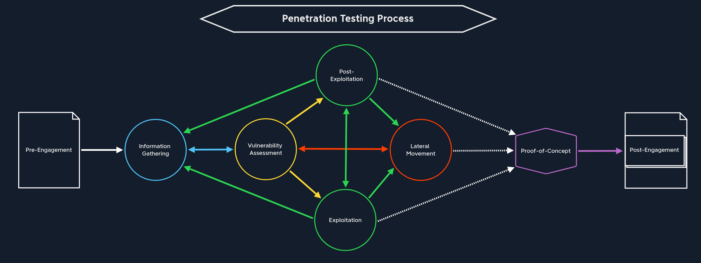

# Pentesting

## Laws and Regulations

Ref: https://academy.hackthebox.com/module/90/section/1980

| Categories                                                                                | USA                                                                                                                                                                 | Europe                                                                                                                                                             | UK                                                                                                            | India                                                                                                                                 | China                                                                                                                                                                                                                                                                    |
| ----------------------------------------------------------------------------------------- | ------------------------------------------------------------------------------------------------------------------------------------------------------------------- | ------------------------------------------------------------------------------------------------------------------------------------------------------------------ | ------------------------------------------------------------------------------------------------------------- | ------------------------------------------------------------------------------------------------------------------------------------- | ------------------------------------------------------------------------------------------------------------------------------------------------------------------------------------------------------------------------------------------------------------------------ |
| Protecting critical information infrastructure and personal data                          | [Cybersecurity Information Sharing Act](https://www.cisa.gov/resources-tools/resources/cybersecurity-information-sharing-act-2015-procedures-and-guidance) (`CISA`) | [General Data Protection Regulation](https://gdpr-info.eu/) (`GDPR`)                                                                                               | [Data Protection Act 2018](https://www.legislation.gov.uk/ukpga/2018/12/contents/enacted)                     | [Information Technology Act 2000](https://www.indiacode.nic.in/bitstream/123456789/13116/1/it_act_2000_updated.pdf)                   | [Cyber Security Law](https://digichina.stanford.edu/work/translation-cybersecurity-law-of-the-peoples-republic-of-china-effective-june-1-2017/)                                                                                                                          |
| Criminalizing malicious computer usage and unauthorized access to computer systems        | [Computer Fraud and Abuse Act](https://www.justice.gov/jm/jm-9-48000-computer-fraud) (`CFAA`)                                                                       | [Network and Information Systems Directive](https://www.enisa.europa.eu/topics/state-of-cybersecurity-in-the-eu/cybersecurity-policies/nis-directive-2) (`NISD 2`) | [Computer Misuse Act 1990](https://www.legislation.gov.uk/ukpga/1990/18/contents)                             | [Information Technology Act 2000](https://www.indiacode.nic.in/bitstream/123456789/13116/1/it_act_2000_updated.pdf)                   | [National Security Law](https://www.chinalawtranslate.com/en/2015nsl/)                                                                                                                                                                                                   |
| Prohibiting circumventing technological measures to protect copyrighted works             | [Digital Millennium Copyright Act](https://www.congress.gov/bill/105th-congress/house-bill/2281) (`DMCA`)                                                           | [Cybercrime Convention of the Council of Europe](https://www.europarl.europa.eu/cmsdata/179163/20090225ATT50418EN.pdf)                                             |                                                                                                               |                                                                                                                                       | [Anti-Terrorism Law](https://web.archive.org/web/20240201044856/http://ni.china-embassy.gov.cn/esp/sgxw/202402/t20240201_11237595.htm)                                                                                                                                   |
| Regulating the interception of electronic communications                                  | [Electronic Communications Privacy Act](https://www.congress.gov/bill/99th-congress/house-bill/4952) (`ECPA`)                                                       | [E-Privacy Directive 2002/58/EC](https://eur-lex.europa.eu/legal-content/EN/ALL/?uri=CELEX%3A32002L0058)                                                           | [Human Rights Act 1998](https://www.legislation.gov.uk/ukpga/1998/42/contents) (`HRA`)                        | [Indian Evidence Act of 1872](https://web.archive.org/web/20230223081850/https://legislative.gov.in/sites/default/files/A1872-01.pdf) |                                                                                                                                                                                                                                                                          |
| Governing the use and disclosure of protected health information                          | [Health Insurance Portability and Accountability Act](https://aspe.hhs.gov/reports/health-insurance-portability-accountability-act-1996) (`HIPAA`)                  |                                                                                                                                                                    | [Police and Justice Act 2006](https://www.legislation.gov.uk/ukpga/2006/48/contents)                          | [Indian Penal Code of 1860](https://web.archive.org/web/20230324123747/https://legislative.gov.in/sites/default/files/A1860-45.pdf)   |                                                                                                                                                                                                                                                                          |
| Regulating the collection of personal information from children                           | [Children's Online Privacy Protection Act](https://www.ftc.gov/legal-library/browse/rules/childrens-online-privacy-protection-rule-coppa) (`COPPA`)                 |                                                                                                                                                                    | [Investigatory Powers Act 2016](https://www.legislation.gov.uk/ukpga/2016/25/contents/enacted) (`IPA`)        |                                                                                                                                       |                                                                                                                                                                                                                                                                          |
| A framework for cooperation between countries in investigating and prosecuting cybercrime |                                                                                                                                                                     |                                                                                                                                                                    | [Regulation of Investigatory Powers Act 2000](https://www.legislation.gov.uk/ukpga/2000/23/contents) (`RIPA`) |                                                                                                                                       |                                                                                                                                                                                                                                                                          |
| Outlining individuals' legal rights and protections regarding their personal data         |                                                                                                                                                                     |                                                                                                                                                                    |                                                                                                               | [Personal Data Protection Bill 2019](https://www.congress.gov/bill/116th-congress/senate-bill/2889)                                   | [Measures for the Security Assessment of Cross-border Transfer of Personal Information and Important Data](https://www.mayerbrown.com/en/perspectives-events/publications/2022/07/china-s-security-assessments-for-cross-border-data-transfers-effective-september-2022) |
| Outlining individuals' fundamental rights and freedoms                                    |                                                                                                                                                                     |                                                                                                                                                                    |                                                                                                               |                                                                                                                                       | [State Council Regulation on the Protection of Critical Information Infrastructure Security](http://english.www.gov.cn/policies/latestreleases/202108/17/content_WS611b8062c6d0df57f98de907.html)                                                                        |

USA
The Computer Fraud and Abuse Act (CFAA) is a federal law that makes it a criminal offense to access a computer without authorization. It applies to computer-related activities, including hacking, identity theft, and spreading malware. The CFAA has been the focus of much criticism and controversy, with some arguing that its provisions are too far-reaching and could be used to criminalize legitimate security research. In addition, critics have raised the concern that people can interpret the CFAA's broad definitions of computer-related activities in a manner that could lead to the prosecution of activities that were not intended to be criminal offenses. Furthermore, the CFAA has been criticized for needing more clarity regarding the meaning of specific terms, making it difficult for individuals to understand their rights and responsibilities under the law. For these reasons, it is crucial for individuals to familiarize themselves with the law and to understand the potential implications of their activities.

The Digital Millennium Copyright Act (DMCA) includes provisions prohibiting circumventing technological measures to protect copyrighted works. This can consist of digital locks, encryption, and authentication protocols, which safeguard software, firmware, and other types of digital content. Security researchers should know the DMCA provisions to ensure their research activities do not violate the law. It is important to remember that circumventing copyright protection measures, even for research or educational activities, can result in civil or criminal penalties. As such, researchers must exercise caution and due diligence to avoid inadvertently running afoul of the DMCA.

The Electronic Communications Privacy Act (ECPA) regulates the interception of electronic communications, including those sent over the Internet. This law makes it unlawful to intercept, access, monitor, or store communications without one or both parties consent. Furthermore, the ECPA prohibits using intercepted communications as evidence in a court of law. The ECPA also outlines the responsibilities of service providers, as they are not allowed to divulge the contents of communications to anyone except the sender and the receiver. Therefore, the ECPA protects the privacy of electronic communications and ensures that individuals are not subjected to illegal interception or use of their communications.

The Health Insurance Portability and Accountability Act (HIPAA) governs the use and disclosure of protected health information and includes a set of rules for safeguarding personal health information stored electronically. Researchers should know these requirements and ensure their research activities adhere to HIPAA regulations. This includes taking measures such as encrypting data, keeping detailed data access, and sharing records. Furthermore, research must be conducted by institutional policies and procedures, and the appropriate governance body must approve any changes made. Researchers must also be mindful of the possibility of data breaches and take steps to ensure that any personal health information is kept secure. Failure to comply with HIPAA regulations can result in severe legal and financial penalties, so researchers must ensure that their research activities comply with HIPAA.

The Children's Online Privacy Protection Act (COPPA) is an important piece of legislation regulating the collection of personal information from children under 13. We must be aware of the provisions of COPPA and take precautions to ensure that our research activities do not violate any of the requirements of the Act. To comply with COPPA, researchers must exercise caution and take special steps to ensure that they are not collecting, using, or disclosing any personal information from children under the age of 13. Failure to comply with COPPA could result in legal action and penalties, so security researchers must familiarize themselves with the Act and comply with its provisions.

Europe
The General Data Protection Regulation (GDPR) regulates the handling of personal data, strengthens individuals' rights over personal data, and imposes penalties of up to 4% of global annual revenue or 20 million euros, whichever is higher for non-compliance. Security researchers should be aware of these provisions and ensure that their research does not run afoul of GDPR. It's important to note that GDPR applies to any company that processes the personal data of EU citizens, regardless of the company's location.

The Network and Information Systems Directive (NISD) requires operators of essential services and digital service providers to take appropriate security measures and report specific incidents. It's important to note that the NISD applies to various organizations and individuals, including those conducting penetration testing and security research.

The Cybercrime Convention of the Council of Europe, the first international treaty on crimes committed via the Internet and other computer networks, provides a framework for cooperation between countries in investigating and prosecuting cybercrime.

The E-Privacy Directive 2002/58/EC regulates the processing of personal data in the electronic communication sector. This directive applies to personal processing data in connection with the provision of publicly available electronic communications services in the EU.

UK
The Computer Misuse Act 1990 was introduced to address malicious computer usage. It is a criminal offense to access a computer system without authorization, modify data without permission, or misuse computers to commit fraud or other unlawful activities. The Act also allows for confiscating computers and other devices used to commission a computer misuse offense and encourages reporting computer misuse incidents to law enforcement authorities. It also provides for the implementation of various measures to help prevent computer misuse, including establishing a special law enforcement team and implementing appropriate security measures.

The Data Protection Act 2018 is an important piece of legislation that provides individuals with certain legal rights and protections regarding their personal data. It details the rights of individuals, such as the right to access their data, the right to have their personal data rectified, and the right to object to the processing of their data. Furthermore, it outlines the obligations of those who process personal data, such as securely and transparently and providing individuals with clear and understandable information about how their data is being used. By considering the Act, security researchers can ensure that their research is conducted responsibly and lawfully.

The Human Rights Act 1998 (HRA) is an important piece of legislation in the United Kingdom that outlines individuals' fundamental rights and freedoms. It incorporates the European Convention on Human Rights into UK law. It ensures that individuals have the right to fair and equal treatment in various areas, such as the right to a fair trial, the right to private and family life, and the right to freedom of expression. It also gives individuals the right to access judicial remedies in cases where their rights have been violated. The Act also gives individuals the right to challenge the legality of any law or administrative action that violates their fundamental rights and freedoms. The HRA is an essential piece of legislation that helps protect individuals from abuse of power and ensures their rights are respected.

The Police and Justice Act 2006 was an Act of Parliament passed in the United Kingdom, which aimed to provide a comprehensive framework for reforming the criminal justice system and policing. The Act established several new criminal offenses, including the violation of inciting religious hatred and measures to protect children from exploitation and vulnerable adults. It also provided for the creation of the Serious Organised Crime Agency and a National DNA Database. The Act also set out new measures to tackle anti-social behavior, including introducing Anti-Social Behaviour Orders. Furthermore, it included provisions to modernize the coroners' system and provide additional powers to the police to combat terrorism. In addition, the Act sought to improve the rights of victims of crime and to provide increased protection for victims of domestic violence.

Investigatory Powers Act 2016 (IPA) regulates the use of investigatory powers by law enforcement and intelligence agencies, including hacking and other forms of digital surveillance. The IPA also requires Internet and other communications providers to retain certain data types for a specified period.

Regulation of Investigatory Powers Act 2000 (RIPA) regulates public authorities' use of covert investigatory techniques, including hacking and other forms of digital surveillance.

India
The Information Technology Act 2000 provides for legal recognition of transactions using electronic data interchange and other means of electronic communication. It also criminalizes hacking and other unauthorized access to computer systems and imposes penalties for such actions.

The Personal Data Protection Bill 2019 is a proposed legislation to protect individuals' personal data and impose penalties for non-compliance.

The Indian Evidence Act of 1872 and the Indian Penal Code of 1860 contain provisions that may be invoked in cases of cybercrime, including hacking and unauthorized access to computer systems. Security researchers should be aware of these laws and ensure our research does not run afoul.

China
The Cyber Security Law establishes a legal framework for protecting critical information infrastructure and personal data and requires organizations to comply with certain security measures and report certain types of security incidents.

The National Security Law criminalizes activities that threaten national security, including hacking and other unauthorized access to computer systems.

The Anti-Terrorism Law criminalizes activities that support or promote terrorism, including hacking and other unauthorized access to computer systems.

The Measures for the Security Assessment of Cross-border Transfer of Personal Information and Important Data regulates the cross-border transfer of personal information and important data and also requires organizations to conduct security assessments and obtain approval from relevant authorities before transferring such data.

The State Council Regulation on the Protection of Critical Information Infrastructure Security regulates critical information infrastructure protection. Also, it requires organizations to take certain security measures and report certain types of security incidents.

### Precautionary Measure
☐	Obtain written consent from the owner or authorized representative of the computer or network being tested
☐	Conduct the testing within the scope of the consent obtained only and respect any limitations specified
☐	Take measures to prevent causing damage to the systems or networks being tested
☐	Do not access, use or disclose personal data or any other information obtained during the testing without permission
☐	Do not intercept electronic communications without the consent of one of the parties to the communication
☐	Do not conduct testing on systems or networks that are covered by the Health Insurance Portability and Accountability Act (HIPAA) without proper authorization

## Pentesting Process

| Stage                         | Description                                                                                                                                                                                                                                                                                |
| ----------------------------- | ------------------------------------------------------------------------------------------------------------------------------------------------------------------------------------------------------------------------------------------------------------------------------------------ |
| `1. Pre-Engagement`           | The first step is to create all the necessary documents in the pre-engagement phase, discuss the assessment objectives, and clarify any questions.                                                                                                                                         |
| `2. Information Gathering`    | Once the pre-engagement activities are complete, we investigate the company's existing website we have been assigned to assess. We identify the technologies in use and learn how the web application functions.                                                                           |
| `3. Vulnerability Assessment` | With this information, we can look for known vulnerabilities and investigate questionable features that may allow for unintended actions.                                                                                                                                                  |
| `4. Exploitation`             | Once we have found potential vulnerabilities, we prepare our exploit code, tools, and environment and test the webserver for these potential vulnerabilities.                                                                                                                              |
| `5. Post-Exploitation`        | Once we have successfully exploited the target, we jump into information gathering and examine the webserver from the inside. If we find sensitive information during this stage, we try to escalate our privileges (depending on the system and configurations).                          |
| `6. Lateral Movement`         | If other servers and hosts in the internal network are in scope, we then try to move through the network and access other hosts and servers using the information we have gathered.                                                                                                        |
| `7. Proof-of-Concept`         | We create a proof-of-concept that proves that these vulnerabilities exist and potentially even automate the individual steps that trigger these vulnerabilities.                                                                                                                           |
| `8. Post-Engagement`          | Finally, the documentation is completed and presented to our client as a formal report deliverable. Afterward, we may hold a report walkthrough meeting to clarify anything about our testing or results and provide any needed support to personnel tasked with remediating our findings. |

### Pre-engagement

* Non-Disclosure Agreement
* Goals
* Scope. 
  - Questions to know the scope, [SANS Pen Test Scope Questionnaire](https://www.sans.org/posters/pen-test-scope-worksheet/), document that proposes synthetizes and describe the method
  - Rules of Engagement, For example [Pen Test Rules of Engagement Worksheet](https://www.sans.org/posters/pen-test-rules-of-engagement-worksheet/)
  - Time Estimation
  - Document "Scope of Work" : contract that describes the work performed(requirements (creds, NDA...), methdologies, goals, targets, contacts, deliverables, timeline, reports, ...)
* Meetings to prepare (kick--off meeting), discuss and validate the engagement

